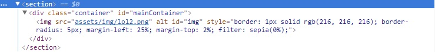

# Filter: plugin para imágenes

## Descripción del módulo

Filter es un plugin que permitirá aplicar filtros en imágenes, estos filtros estan definidos como:

+ Gray scale: cambiará la imagen a una escala de grises.
+ Hue-rotate: rotará los colores de la imágen.
+ Sepia: cambiará la imagen al estilo Sepia, imitando las fotografías antiguas
+ Inverso: convertirá la fotografía a negativo.
+ Saturar: intensificará los colores de la imágen.

## Instrucciones de instalación

## Uso y documentación del API

Para poder utilizar este plugin, deberá crear una `section` con `
` con la `clase="container"` y un `id="mainContainer"`, este será quien contenga  a la imágen en la que utilizaremos los filtros, esta imágen debe tener un `id="img"`

A través de DOM se crearán los botones con los filtros respectivos
